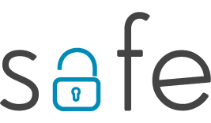

# SAFE - A web stack designed for developer happiness

The following document describes a [SAFE-Stack](https://safe-stack.github.io/) sample project that brings together CQRS/Event-Sourcing on the backend and the Elm architecture on the frontend.

SAFE is a technology stack that brings together several technologies into a single, coherent stack for typesafe,
flexible end-to-end web-enabled applications that are written entirely in F#.



# SAFE-ConfPlanner


[](https://travis-ci.org/SAFE-Stack/SAFE-ConfPlanner)

This is the sample project that is used in the talk "Domain Driven UI" ([Slides](http://bit.ly/DomainDrivenUi)). The title is a bit misleading as it is a bad name for "Reusing your datatypes and behaviour from your CQRS/Event-Sourced models in your Elm-architecture application."

Given you use F# and Fable, you can actually build simple eventually connected systems and have the exact same model working in back and frontend.

The application showcases a couple of things:

* The reuse of the complete domain model on the client and server.
* It shows the nice fit of and similarity between CQRS/Event-Sourcing on the backend and the Elm-Architecture on the frontend.
* It reuses projections from the backend in the update function of the elmish app. The backend is sending domain events to the frontend and the (Elm-)model is updated with the help of projections defined in the backend (on all clients that are connected via websockets).
* It shows an easy way of implementing "Whatif"-Scenarios, i.e. scenarios that enable the user try out different actions. When the user is happy with the result the system sends a batch of commands to the server. When "Whatif-Mode" is enabled the client reuses not only the projections but also the domain behaviour defined on the server to create the events needed by the update function. The potential commands are also stored.
* There is also an "All or nothing" mode for whatifs. If one command does not succeeds, none of them succeeds
* It uses the awesome [Fulma](https://mangelmaxime.github.io/Fulma/) library for styling
* It has BDD Style tests that show how nice the behaviour of Event-Sourced systems can be tested.
* Websockets with Elmish/Suave

## Content
This project consists of 6 dotnetcore subprojects
* `Domain` - Message-based CQRS implementation of the Domain of a ConferencePlanner.
* `Domain.Tests` - BDD-Style Tests for the `Domain`
* `Client` - [Fable](http://fable.io/) Project that uses the Elm-Architecture (with [Fable-Elmish](https://elmish.github.io/elmish/)). It reuses the projections of the `Domain` project. Furthermore it and can also reuse the behaviour of the Domain (when switched to `WhatIf-Mode`)
* `Server` - A Suave Webserver that allows the Client to connect via Websockets.
* `EventSourced` - This is where all the backend infrastructure is implemented. It contains an event store with a simple in-memory storage, command and query handlers and the types that hold everything together. Most of the infrastructure is implemented asynchronously with the help of F#s awesome [Mailbox Processors](https://fsharpforfunandprofit.com/posts/concurrency-actor-model/)
* `Support` - A simple project to fill the EventStore with some initial values.

## Requirements

- [dotnet core SDK 3.1.x](https://dotnet.microsoft.com/download) The .NET Core SDK
- [node.js](https://nodejs.org/) - JavaScript runtime
- [yarn](https://yarnpkg.com/) - Package manager for npm modules

## Installation/Development mode
This development stack is designed to be used with minimal tooling. An instance of Visual Studio Code together with the excellent [Ionide](http://ionide.io/) plugin should be enough.

- Clone the repository
- In the cloned directory
  - install paket: `dotnet tool restore`
  - install dotnet packages: `dotnet paket install`
  - install js packages: `yarn install`
- for the tests
  - run `dotnet test`in the root dir
- for the client
  - run `yarn watch` in the root dir
- for the server
  - open another terminal and go to `src\Server`
  - run `dotnet run` for the server (or `dotnet watch run` for watchmode)
- go to `localhost:8080`
- enjoy


## Plans for the future
From the top of my head. If anyone wants to chip in, feel welcome.

### Deployment
* make use of Azure to deploy the application

### Infrastructure
* extract the project into its own repository and make it a bit more production ready :D
* implement at least one different event store implementation (e.g. SQLite or Azure something something)
* implement projections that can send notifications

### Server
* switch to giraffe
* implement a proper autohrization system

### Domain
* would build the domain a bit differently nowadays
* build an actual Conference Planner

## Known Issues

### Getting rid of errors in chrome/firefox

- Either comment out the lines in `App.fs`:

```fsharp
#if DEBUG
|> Program.withDebugger
#endif
```

- Or install the [Redux DevTools](http://extension.remotedev.io/) as a Chrome/Firefox Extensions (recommended)
Only one error remains, when visiting the WebApp the first time.

## Maintainer(s)

- [@rommsen](https://github.com/rommsen)
- [@heimeshoff](https://github.com/heimeshoff)
- you?
